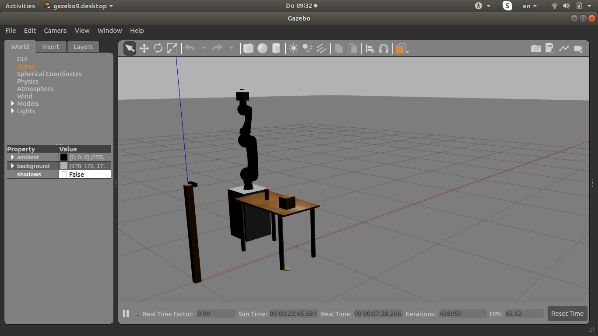
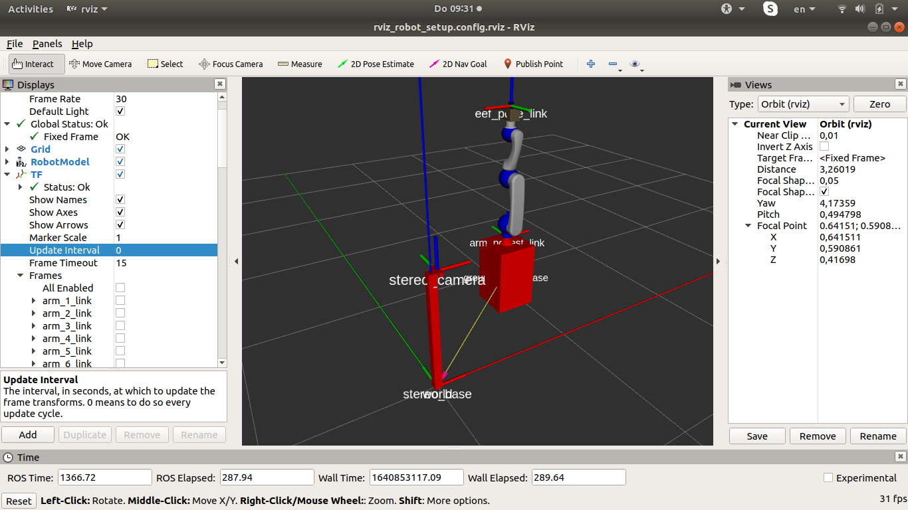
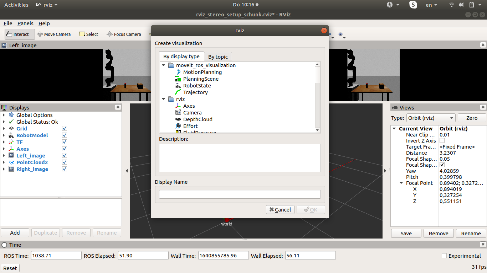
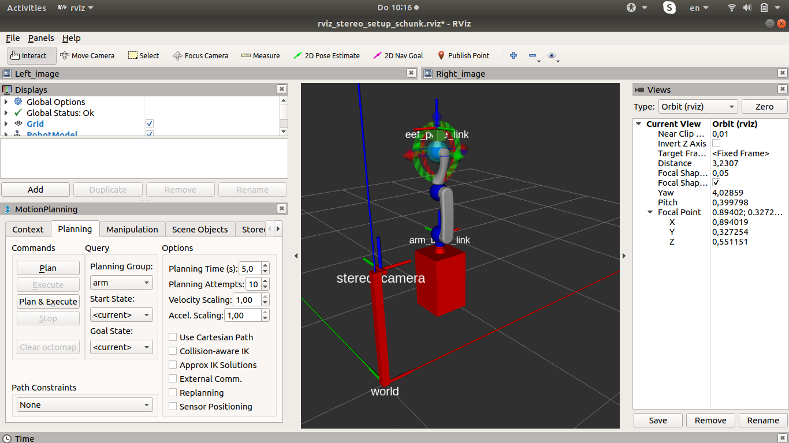
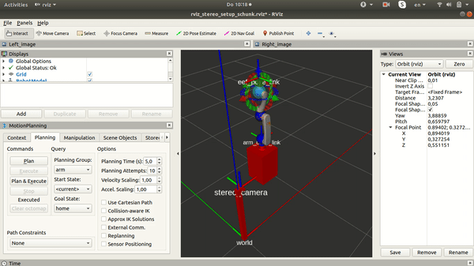
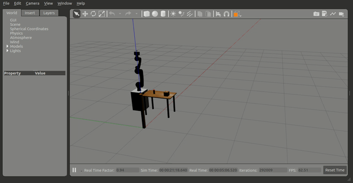
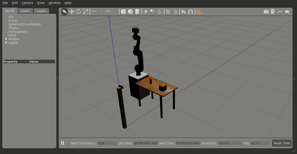
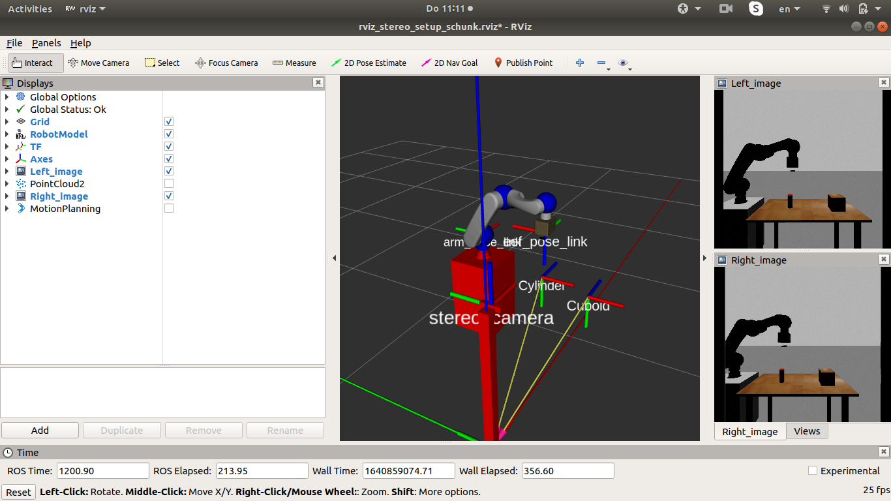

### SCHUNK LWA4P - ROS Manipulation 

[**ROS MoveIt**](https://moveit.ros.org/documentation/concepts/) is used in this project to conrol the manipulation and grasping of the objects detected through [stereo vision](https://docs.opencv.org/4.x/dd/d53/tutorial_py_depthmap.html). 

The description file of the **Schunk** robot is taken from the public [repository](https://github.com/ipa320/schunk_modular_robotics) of Frauenhofer IPA. The description files provided by Frauenhofer are separate for the [robot arm](https://github.com/ipa320/schunk_modular_robotics/tree/kinetic_dev/schunk_description/urdf/lwa4p) and [gripper](https://github.com/ipa320/schunk_modular_robotics/tree/kinetic_dev/schunk_description/urdf/pg70).

Therefore, the URDF file for the robot with the gripper is created in the package [*schunk_lwa4p*](./schunk_lwa4p). All packages developed and provided in this repository are tested in **Ubuntu 18.04** with **ROS-Melodic**. On following the instructions that has to be executed in the terminal, it is assumed that the [**catkin_workspace**](http://wiki.ros.org/catkin/Tutorials/create_a_workspace) for **ros** is built and available.

### Build Instructions
```sh
cd ~/path_to_ros_catkin_workspace/src
git clone https://github.com/Irudhaya/Schunk_Robot_Manipulation.git
cd ..
catkin_make
source devel/setup.bash
```

### Launch Packages - MoveIt Manipulation
Before the execution of packages provided in this repository *MoveIt* and ros controllers for MoveIt and Gazebo has to be installed. 
```sh
sudo apt install ros-melodic-moveit*
sudo apt install ros-melodic-joint-trajectory*
``` 
Inorder to open the [**Gazebo**](http://gazebosim.org/) world and [**RVIZ**](http://wiki.ros.org/rviz) for visualising the frames of the robot execute the following command in the terminal.
```sh
roslaunch schunk_lwa4p robot_controller.launch
```
* Gazebo World with Schunk Arm

* RVIZ (Schunk Arm)


The configuration of **MoveIt** for **Schunk - LWA4P** is developed in this project by following these [tutorials](http://docs.ros.org/en/melodic/api/moveit_tutorials/html/doc/setup_assistant/setup_assistant_tutorial.html) with [MoveIt Setup Assistant](http://docs.ros.org/en/melodic/api/moveit_tutorials/html/doc/setup_assistant/setup_assistant_tutorial.html) To launch the MoveIt node for the schuk arm which controls the manipulation of the arm,execute the following command in the terminal. 
```sh
roslaunch schunk_arm_pg70_moveit_config move_group.launch
```
Note, though that the node provided by MoveIt is capable of doing path planning with collision avoidance, in this project there is no input to the node inorder to check for collision avoidance. Therefore, in this project the manipulation of the robot arm is carried under controlled conditions.

After launching the above mentioned packages and nodes, **MoveIt Motion Planning** plugin from MoveIt can be added in RVIZ with the following steps,

* Select ```Add``` in bottom left corner of the RVIZ window. The following window is displayed in RVIZ and it can be visualised as follows,



* Select ```MotionPlanning``` under ```moveit_ros_visualization``` in the tab ```By display type``` and click ```OK``` at the bottom right of the window. The Motion Plannig plugin from MoveIt will be added in RVIZ and the visualisation will be similar as in the following image.



#### MoveIt - RVIZ 

Motion Planning plugin in RVIZ can be used to control the robot to reach the specified pose. While configuring the MoveIt for the Schunk arm, predefined poses are also set. These predefined poses are very useful in situations, where the robot has to reach a particular before executing a task. 
Two predefined poses are set for the Schunk arm,
* __home__
* __start_grasp__

In the ```MotionPlanning``` window under ```Planning``` tab in ```Query``` section the predefined goal poses can be selected. Since the robot is started with the default pose as **home**, check of **start_grasp** pose can be performed by following the instructions listed below.

1. Select drop down under ```Goal State``` in ```Query``` section to check for the predefined poses.
2. Select **start_grasp**
3. Select ```Plan``` under ```Commands``` section. This will show the path taken by the robot arm to reach the selected goal pose. This is the visualisation of the path planned by **MoveIt**.
4. To execute the **path** planned by **MoveIt**, select ```Plan & Execute``` under ```Commands``` section.

On performing the steps mentioned above the result can be seen as follows,

**RVIZ**



**GAZEBO**




#### Grasp Detected Objects

After launching the packages for bringing up the robot in Gazebo and node to control the robot arm through MoveIt the following commands has to be executed in the terminal.

```sh
roslaunch pose_estimation pose_estimation.launch
roslaunch pose_estimation stereo_point_cloud.launch
```
The above command provides the ros node that calculates the pose of the object with respect to world frame (origin in Gazebo). Calculation of the pose is done throgh [PNP Algorithm](https://docs.opencv.org/4.x/d7/d53/tutorial_py_pose.html). For more details on pose estimation refer this [repository](https://github.com/Irudhaya/Stereo_Vision_Pose_Estimation). The pose of the objects detected is broadcasted as transforms through [Transform Broadcaster](http://wiki.ros.org/tf2) provided by ROS. Additionally the node also publishes the height information of the objects detected by the stereo camera in the world. Height information of the object is necessary to calculate the grasp pose which is performed by the node provided by this [package](./pick_primitve_shapes). Since the detection of objects is implemented by detecting the contours of the object, the area under the detected contours is hand tuned to successfully detect the object. Therefore, for other objects the area has to be tuned. This can be done by changing the numbers in this [python  script](./pose_estimation/src/stereo_image.py) under the function named ```detect_objects_contours```. 

In the currently implemented code the areas are set for **Cylinder** and **Cuboid** as follows, since they are the only objects in the Gazebo World.
```python
#considering only the cube and cylinder objects in the scene (area is hand tuned)
if (area > 950 and area < 1300):
	#print(area)
	area_centroid.append({"area":area,"cx":cx,"cy":cy,"contour":i,"name":"Cylinder"})
if (area > 5000 and area < 6000):
	#print("Cuboid")
	area_centroid.append({"area":area,"cx":cx,"cy":cy,"contour":i,"name":"Cuboid"}) 
```

Also to grasp the object, the maximum distance between the left and right finger of the robot gripper has to be considered. Due to the mechanical constraint of the robot gripper, only the **Cylinder** pose is provided as input to the MoveIt node to calculate the path to grasp the object. Necessary changes in the [script](./pick_primitive_shapes/src/pick_primitive_shapes.py) is required to grasp the other objects. Consider the distance between the object and robot location, because reachability of the robot is limited due to mechanical design. If MoveIt is provided with a pose of the object that is outside the cartesian space covered by the Robot then MoveIt fails to plan a path.

To grasp the **Cylinder** object in the scene, execute the following command in the terminal.
```sh
rosrun pick_primitive_shapes pick_primitive_shapes.py 
```
Grasping of the object by the Robot in Gazebo can be seen as follows,



In RVIZ the status of the Robot can also be seen, wherein the the frames of the robot movement can be seen indicating the state after the robot has completed the grasp.




